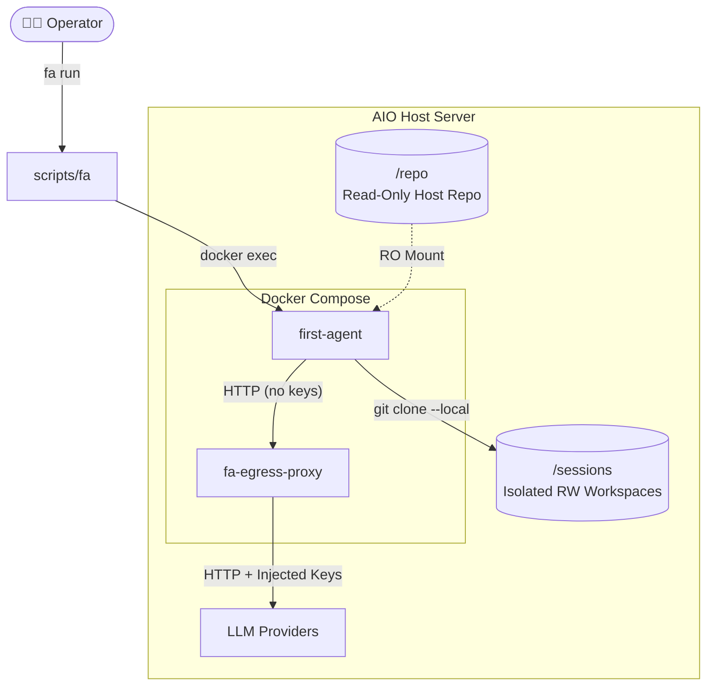

# First-Agent

> **Locally orchestrated, mixed-tier LLM coding agent for power-users.**  
> Built on the principles of Unix-way, zero-trust LLM isolation, and minimalism-first.

⭐ **Краткий обзор фичей и архитектуры (PITCH): [FEATURES.md](./FEATURES.md)**  
📖 **Деплой / обновление / управление (AIO Server):** [knowledge/instructions/README.md](./knowledge/instructions/README.md)  
🤖 **Для LLM-агентов (Start Here):** [AGENTS.md](./AGENTS.md)

---

## 🏗 Архитектура безопасности (By-Design)

Мы не доверяем LLM слепо. First-Agent заперт в детерминированной песочнице: ключи изолированы в отдельном контейнере, а работа над кодом ведется только во временных Git-клонах.

<b>Развернуть полное описание Scope и Зачем это нужно</b>

## 1. Зачем это

**First-Agent** — research-backed implementation-first проект, стремящийся
стать open-source reference implementation для locally orchestrated coding agents. 
Помимо самого факта построения работающего harness, проект ставит 4 явных цели:

1. Пройти весь путь от формулировки до working prototype, документируя
   каждое архитектурное решение через ADR + research note.
2. Выпустить v0.1 как pragmatic single-user product под UC1 (coding+PR) +
   UC3 (local-docs-to-wiki) с hybrid-shape (filesystem-canon + lazy
   search-side scaling).
3. Построить **наиболее token- и tool-call-efficient harness** среди
   известных open-source / open-design агент-стэков.
4. **Iteration via measurement.** База в v0.1 — способность агента писать
   собственные skills (`SKILL.md`-файлы) по итогам решённых задач.

**Принцип построения — minimalism-first.** Не «вырезать лишнее потом», а
не добавлять без research-evidence или измеренного KPI-impact.

Опора — research papers (Tsinghua module-ablation,
Stanford / Khattab Meta-Harness, Anthropic engineering posts), MCP-экосистема.

## 2. Scope — что входит и что не входит

### В scope (v0.1)

- **UC1** — coding + PR-write end-to-end.
- **UC3** — local-docs-to-wiki (`fa ingest`, chunk-aware retrieval, Q&A).
- Static role-routing LLM tiering (Planner / Coder / Debug),
  mechanical-wiki memory (SQLite FTS5), sandbox + path allow-list для тулов.

### Вне scope (v0.1)

- **UC2** continuous multi-source research — best-effort.
- **UC4** multi-user Telegram chat — deferred.
- **UC5** semi-autonomous multi-LLM research/experiment — deferred.
- Production-деплой, мульти-тенантность, биллинг, собственный веб-UI.

---

## 🧭 Как работать с этим репо

Полный inventory всех документов — в
[`knowledge/llms.txt`](./knowledge/llms.txt) (one-fetch индекс,
[llmstxt.org](https://llmstxt.org/) convention). Конвенции по
структуре и работе — в [`AGENTS.md`](./AGENTS.md).

Для нового человека / агента:

1. Прочитать [`AGENTS.md`](./AGENTS.md) — repo conventions, query routing.
2. Прочитать [`knowledge/llms.txt`](./knowledge/llms.txt) — карта
   репо в одном fetch'е.
3. Проверить [`HANDOFF.md`](./HANDOFF.md) — текущий snapshot
   состояния репо для cross-LLM сессий.
4. Просмотреть индекс ADR — [`knowledge/adr/README.md`](./knowledge/adr/README.md).

Дальше — по необходимости (ADR / research-нота / промпт). Не нужно
загружать всё в контекст сразу; routing-table в
[`AGENTS.md` §Query Routing](./AGENTS.md#query-routing).

---

## 📂 Основные папки и файлы

- [`FEATURES.md`](./FEATURES.md) — обзор фичей и киллер-фич продукта.
- [`AGENTS.md`](./AGENTS.md) — конвенции и инструкции для AI-агентов.
- [`HANDOFF.md`](./HANDOFF.md) — snapshot состояния для cross-LLM сессий.
- [`knowledge/README.md`](./knowledge/README.md) — как устроена память
  проекта (frontmatter schema, конвенции).
- [`knowledge/llms.txt`](./knowledge/llms.txt) — one-fetch индекс всех документов.
- [`knowledge/instructions/`](./knowledge/instructions/README.md) —
  инструкции по развёртыванию и эксплуатации (install + operations).
- [`knowledge/adr/README.md`](./knowledge/adr/README.md) — индекс архитектурных решений (ADR).
- [`knowledge/pr-notes/`](./knowledge/pr-notes/README.md) — архив PR-заметок.

---
