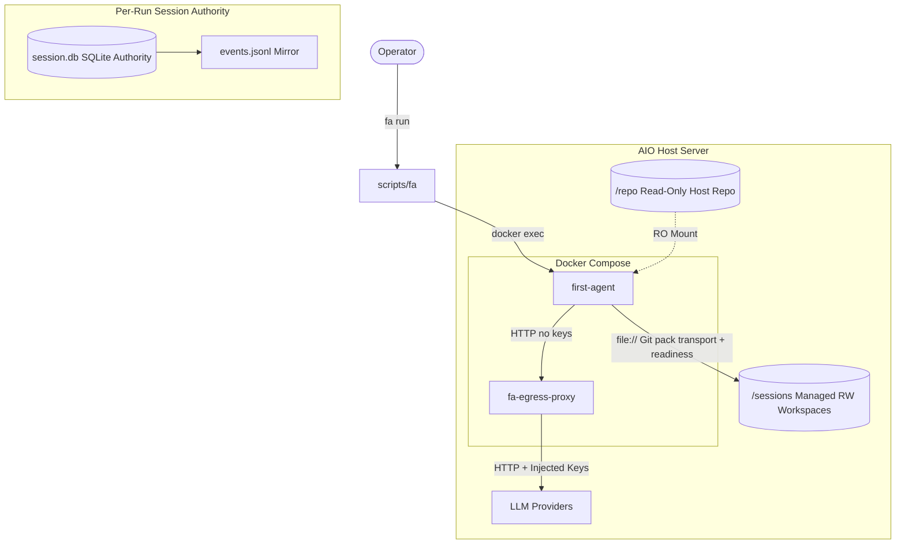

# First-Agent

> **Locally orchestrated, mixed-tier LLM coding agent for power-users.**
> Built on the principles of Unix-way, zero-trust LLM isolation, and minimalism-first.

📖 **Deploy / operate (AIO Server):** [knowledge/instructions/README.md](./knowledge/instructions/README.md)
🤖 **For LLM agents (Start Here):** [AGENTS.md](./AGENTS.md)

---

## Architecture at a Glance

We don't trust the LLM blindly. First-Agent is locked in a deterministic sandbox:
API keys are isolated in a separate container, and code changes happen only in
managed Git clones. Per-run session state is authoritative in SQLite (`session.db`);
JSONL files are best-effort human-readable mirrors.

```mermaid
graph TD
    User([Operator]) -->|fa run| HostWrapper[scripts/fa]
    HostWrapper -->|docker exec| AgentContainer

    subgraph AIO Server [AIO Host Server]
        Repo[(/repo Read-Only Host Repo)]

        subgraph Docker Compose
            ProxyContainer[fa-egress-proxy]
            AgentContainer[first-agent]
        end

        AgentContainer -- HTTP no keys --> ProxyContainer
        ProxyContainer -- HTTP + Injected Keys --> LLM[LLM Providers]

        Repo -.->|RO Mount| AgentContainer
        AgentContainer -->|file:// Git pack transport + readiness| Sessions[(/sessions Managed RW Workspaces)]
    end

    subgraph Session Data [Per-Run Session Authority]
        SessionDB[(session.db SQLite Authority)]
        JSONL[events.jsonl Mirror]
        SessionDB --> JSONL
    end
```

<b>Full Scope & Rationale</b>

**First-Agent** is a research-backed implementation-first project aiming to become
the open-source reference implementation for locally orchestrated coding agents.
Four explicit goals:

1. Walk from formulation to working prototype, documenting every architectural
   decision via ADR + research note.
2. Ship v0.1 as a pragmatic single-user product for UC1 (coding+PR) + UC3
   (local-docs-to-wiki) with hybrid-shape (filesystem-canon + lazy search-side scaling).
3. Build the **most token- and tool-call-efficient harness** among known open-source
   agent stacks.
4. **Iteration via measurement.** v0.1 baseline: agent can write its own skills
   (`SKILL.md` files) from completed tasks.

**Design principle — minimalism-first.** Not "cut later" — don't add without
research-evidence or measured KPI-impact.

**In scope (v0.1):** UC1 coding+PR, UC3 local-docs-to-wiki, static role-routing
LLM tiering, mechanical-wiki memory (SQLite FTS5), sandbox + path allow-list.

**Out of scope (v0.1):** UC2 multi-source research (best-effort), UC4 multi-user
Telegram chat (deferred), UC5 semi-autonomous research (deferred), production
deploy, multi-tenancy, billing, web UI.

---

## Key Features

- **Session Database Authority** — Every `fa run` creates a per-run SQLite database
  (`session.db`) that is the single source of truth for hot-path runtime state.
  Three tables: event_log, blackboard, session_meta. JSONL files are best-effort
  mirrors — if they disagree with session.db, session.db wins.

- **Blackboard Conflict Detection** — When `edit_file` or `write_file` writes,
  the Blackboard checks for conflicts: if entry B's `read_set` overlaps with a
  prior entry A's `write_set`, `detect_conflict()` returns a structured failure.
  Prevents the "parent HEAD switched" bug.

- **Egress-Injection Proxy (ADR-12)** — API keys live only in a separate
  `fa-egress-proxy` container. The agent reaches providers through the proxy
  (HTTP + non-key token); proxy injects the real key. Agent can *use* keys but
  never *read* them.

- **Trusted Computing Base (ADR-11)** — Two-tier authoring TCB: frozen stdlib-only
  Level-0 kernel + allowlisted Level-1 rules. LLM as Untrusted Compiler threat
  model. Test-decay lock prevents `pytest.skip` / `assert True` gaming.

- **Bash Intent Analysis** — `fs_run_bash` is parsed through `bashlex` AST.
  IntentGuard classifies: `READ_ONLY`, `INDEX_WRITE`, `REPO_WRITE`, `DANGEROUS`.
  REPO_WRITE blocked without authorized PR draft.

- **Token-Efficient Retrieval** — Mechanical Wiki: filesystem-canon Markdown +
  SQLite FTS5 BM25. No vector DB, no embeddings in v0.1. Tools have
  `max_context_bytes` with automatic head/tail elision.

---

## Quick Start

**For humans:**

1. Deploy & operate: [knowledge/instructions/](./knowledge/instructions/README.md)
2. Project vision & scope: [knowledge/project-overview.md](./knowledge/project-overview.md)

**For agents:**

1. Read [AGENTS.md](./AGENTS.md) — repo conventions, query routing, pre-flight checklist
2. Read [knowledge/llms.txt](./knowledge/llms.txt) §MUST READ FIRST — 5-file bootstrap
3. Read [worklogs/HANDOFF.md](./worklogs/HANDOFF.md) — current session state
4. Definitions & session architecture: [knowledge/reference.md](./knowledge/reference.md)

---

## Repository Map

| Path | Purpose |
| --- | --- |
| [`AGENTS.md`](./AGENTS.md) | Agent session rules, conventions, query routing |
| [`knowledge/project-overview.md`](./knowledge/project-overview.md) | Vision, principles, scope |
| [`knowledge/reference.md`](./knowledge/reference.md) | Terms, features, session architecture |
| [`worklogs/HANDOFF.md`](./worklogs/HANDOFF.md) | Current session state & next priorities |
| [`worklogs/BACKLOG.md`](./worklogs/BACKLOG.md) | Active milestones & tracked items |
| [`knowledge/adr/`](./knowledge/adr/README.md) | Architecture Decision Records |
| [`knowledge/research/`](./knowledge/research/) | Research notes |
| [`knowledge/skills/`](./knowledge/skills/README.md) | Agent-loadable disciplines (SKILL.md) |
| [`knowledge/anti-patterns/`](./knowledge/anti-patterns/README.md) | Named anti-pattern catalog |
| [`knowledge/instructions/`](./knowledge/instructions/README.md) | Deploy & operating docs (human) |
| [`worklogs/pr-notes/`](./worklogs/pr-notes/README.md) | PR notes archive |
| [`worklogs/implementation-plans/`](./worklogs/implementation-plans/) | Active implementation plans |
| [`worklogs/archive/`](./worklogs/archive/) | Finished work artifacts |

---
