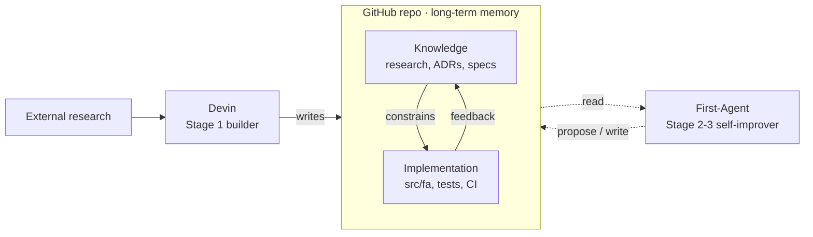

# Project Overview — First-Agent

> **Status:** updated 2026-05-25. Source for v0.1 scope decisions in
> [ADR-1](./adr/ADR-1-v01-use-case-scope.md), `DIGEST.md`.
> Add Refresh task after PR creation.

## 1. Problem statement

First-Agent (FA) is a **locally orchestrated, mixed-tier LLM coding
agent** for a single power-user with deterministically bound harness.

It exists because:

- Hosted coding agents (Devin, Cursor, Copilot Workspace) are great
  but expensive at scale and constrained to their own context-/memory-
  models. We need a setup where **planner / coder / debug roles can
  use different LLM tiers** (top-tier OSS / mid-tier OSS / Anthropic
  elite) under our config control.
- Local "GraphRAG" stacks (MS GraphRAG, LightRAG, HippoRAG) optimise
  *reading* but produce write-side bookkeeping the user has to
  maintain. LLM-Wiki stacks (Karpathy, AI-Context-OS, sparks) optimise
  *writing* but read-side is often grep+BM25 only.
- We want the **hybrid**: filesystem-canon (human-readable, git-able,
  diff-reviewable) **plus** a search-side that scales by lazily
  adding capability (BM25 → vectors → graph) only when the corpus
  justifies it.

## 1.1. Четыре столпа цели (project goal — four pillars)

Goal проекта формулируется в 4 явных столпах:

### Pillar 1 — Research-backed implementation-first reference

First-Agent — implementation-first проект с явной целью стать
open-source reference implementation для locally orchestrated coding
agents. Каждое архитектурное решение фиксируется через ADR
([`knowledge/adr/`](./adr/)) + research note
([`knowledge/research/`](./research/)).
Research notes used as reference for future deveopement.

### Pillar 2 — Pragmatic single-user product

v0.1 ships как locally orchestrated, mixed-tier coding agent для
single power-user под UC1 (coding+PR) + UC3 (local-docs-to-wiki).
Hybrid-shape (filesystem-canon Markdown + lazy search-side scaling
BM25 → vectors → graph) — sustained design choice, не временное
решение. Архитектура зафиксирована в ADR-1..ADR-6.

### Pillar 3 — Most token/tool-call efficient harness (open-source scope)

Один из главных проектных axes — построить **наиболее token- и
tool-call-efficient harness** среди известных open-source /
open-design агент-стэков под целевые UC1+UC3 при single-user
single-workstation use. «Эффективный» означает измеримое:

1. Median tokens / completed task (UC1).
2. Median tool-calls / completed task (UC1).
3. Tools-in-context при старте session (UC1).
4. API cost (USD) / completed task (UC1).

Числа фиксируются после landing UC5 (eval-harness) и первого
baseline-run. До baseline KPI-numbers стоят как `TBD` и не
блокируют v0.1 deliverable.

### Pillar 4 — Iteration via measurement

Эффективность не декларируется — она измеряется и улучшается
итерациями. **База в v0.1:** способность агента писать собственные
skills (`SKILL.md`-файлы под `~/.fa/skills/` или
`knowledge/skills/`) по итогам решённых задач и найденных улучшений.
Pattern взят из Anthropic Claude Skills + Devin `.devin/skills/`,
адаптирован под Mechanical Wiki shape (frontmatter + FTS5-индекс
по ADR-3 / ADR-4). Skill-writing capability требует **ADR-8 (TBD)**;
здесь фиксируется как v0.1 commitment, конкретный design — в
последующем PR.

**Поверх в UC5 v0.2:** benchmark-suite → eval report → manual or
skill-write-based modification → re-benchmark → leaderboard.
Подробнее expanded scope — ADR-1 §Amendment 2026-05-06.

## 1.2. Enforceable principle — minimalism-first

> **Принцип, не goal.** Каждый предлагаемый новый компонент harness
> (тулзов, prompt-уровня, retrieval-стадия) должен пройти 5-вопросный
> тест перед добавлением:
>
> 1. Какая research-evidence (peer-reviewed paper, primary-source
>    blog от lab/foundation, eval-report) поддерживает необходимость
>    этого компонента под наш UC1+UC3 single-user scope?
> 2. Существует ли open-source агент-стэк, который **уже** удалил
>    или не добавил похожий компонент, и какой был результат?
> 3. Если компонент не добавить — какой конкретный capability мы
>    теряем, и можно ли заменить его существующим тулом или
>    config-настройкой?
> 4. Compliance-by-construction, failure-observable.
>    строим harness так, что закрыть failure modes deterministicaly.
>    Можно ли реализовать задачу детерминированной Python-функцией
>    **без LLM-вызова**? Если LLM-вызов не нужен для качества
>    результата (например, шаг — это парсинг, форматирование, агрегация,
>    fan-out по списку, lookup в файле), функция — правильный
>    дефолт; LLM-вызов оправдан только когда требуется суждение,
>    которое нельзя выразить детерминированно.
>
> Если ответ на (1) — «нет evidence», или (2) — «удалили без потерь»,
> или (3) — «можно заменить», или (4) — «функция справится» — компонент
> **rejected** в текущей форме (LLM-step) в v0.1; для (4) допустимо
> вернуться с design'ом, где этот шаг — код, а не вызов модели.
>
> После UC5 landing — re-check: новый компонент должен снизить хотя
> бы один KPI Pillar 3 на reproducible benchmark; иначе rejected.

**minimalism-first, subtraction-second.**
**Minimalism** - не добавлять без evidence.
читаем research papers, изучаем опыт чужих ошибок: failure modes других harness,
overengineering Critic-loops, dynamic prompt-assembly без cache-
invariant - используем прошлый опыт.

References supporting principle: см.
[`research/efficient-llm-agent-harness-deep-dive-2026-05.md`](./research/efficient-llm-agent-harness-deep-dive-2026-05.md)
§3.5 + §0 R-7 (Anthropic «code execution» subtraction
principle, Tsinghua module-ablation `arXiv:2603.25723`).

### 1.2.5. — compliance-by-construction, failure-observable

> **Принцип, не goal.** Sibling rule to §1.2 minimalism-first.
> Where §1.2 asks «should this harness component exist?», §1.2.5
> asks «when it exists, is its compliance with the harness
> contract enforced by construction rather than by LLM judgement
> — and when it fails, is the failure observable to the agent
> and the operator?»
>
> Compliance-by-construction means the harness layer that wraps
> the LLM call (sandbox, tool registry, hook pipeline, validator,
> retry budget, cost guardian) closes failure modes
> **deterministically**: the LLM picks a label, the harness
> mechanically derives the consequence; the LLM emits a tool
> call, the harness validates against a closed schema; the LLM
> writes text, the harness verifies against a regex or exit-code
> contract. The LLM never has a degree of freedom on a
> spec-bearing decision.
>
> Failure-observable means the harness MUST surface every
> compliance gap as a structured WARNING (or higher severity)
> the operator and the next agent session can read. Silent skips,
> partial-validation paths, and «we'll catch it next time» fallbacks
> are forbidden. When a deterministic check cannot fire (e.g.
> partial config, missing role declaration), the harness emits a
> WARNING surface, never a silent pass.

**Decision provenance.** Placement chosen in
[`research/fa-abc-synthesis-deep-dive-2026-05.md` §6b](./research/fa-abc-synthesis-deep-dive-2026-05.md#6b-125-placement-decision--compliance-by-construction)
over Pillar-5 alternative: Pillars 1-4 declare what FA *is* (the
product surface); §1.2 declares *how* FA is built (the
construction discipline). Compliance-by-construction is a
how-axis principle — it governs how harness components are
built, not what the product *is* — so §1.2.5 keeps the
categorical separation clean and sits next to the §1.2
minimalism-first 4-question test that already governs related
decisions.

**Invariants.** The five named invariants instantiating this
principle are
[`ADR-10` §1 I-1..I-5](./adr/ADR-10-deterministic-harness-invariants.md#1-the-invariants-i-1i-5):
I-1 single-source-of-truth classifier; I-2 numbered MANDATORY
workflows are A-bucket residue; I-3 stable `[CODE]` prefix on
every B-message; I-4 typed loop-state ownership (loop OWNS,
middleware READS); I-5 layer-boundary fail-fast.

#### Anti-shallow-fix gate

The construction discipline above is **declarative**: it states what
the harness must do. The **operational companion** — the
forward-acting forcing function that catches shallow «defensive
guard at the call-site» fixes that do not name the producer-site
degree of freedom they were ostensibly closing — lives as a
loadable skill at
[`knowledge/skills/pr-creation/SKILL.md`](./skills/pr-creation/SKILL.md)
and applies to every PR with `INTENT: FIX` (see
[`AGENTS.md` PR Checklist rule #12](../AGENTS.md#pr-checklist) for
the load-directive).

Operationally, FIX PRs carry `DEGREE-OF-FREEDOM CLOSED:` +
`DETERMINISTIC MECHANISM:` clauses; the mechanism citation MUST
end with `repo/file.ext:line` resolving against the staged tree
(or `n/a (reason)` for FIX PRs with no agent surface). Tautological
mechanisms (string-identical to the degree-of-freedom clause) or
missing fields escalate the PR from `CLASS: REPAIR` to
`CLASS: WORKAROUND` and catalogue under
[`AP-003-shallow-fix-no-mechanism.md`](./anti-patterns/AP-003-shallow-fix-no-mechanism.md).
The asymmetry is the wedge: a cheap-scope guard is cheap to write
but **expensive to dress up convincingly with a real
`path/file.ext:line` citation that closes a *named* degree of
freedom** — a reviewer spots the tautology in two seconds. The
gate is *action-count* mitigation per
[`AP-001` §Why-the-wrong-shape-dominates](./anti-patterns/AP-001-spec-bypassing-workaround.md),
not *rule-count* mitigation; the discipline lives in the
mechanically-verifiable citation, not in remembered prose. Full
field semantics, hook behaviour, and worked examples live in the
skill body — this §1.2.5 retains only the principle and the
declarative form.

**Five KPI candidates** (companion analysis
`fa-drift-analysis-v2.md` §4, surfaced in the deep-dive's §6b at
[`research/fa-abc-synthesis-deep-dive-2026-05.md:1968-1978`](./research/fa-abc-synthesis-deep-dive-2026-05.md#6b-125-placement-decision--compliance-by-construction);
each carries a concrete OSS pattern instance):

1. **Exit-code contracts** (rtk R1 pattern — verbatim:
   `rtk/hooks/claude/rtk-rewrite.sh:50-78` + logic source
   `rtk/src/discover/registry.rs::classify_command`). Every
   external integration adapter MUST encode its allow / deny /
   ask / passthrough decision as a four-state exit code; the
   LLM never picks the rewrite, the registry does. Cited in
   deep-dive
   [§1.7 R1 lines 2024–2055](./research/fa-abc-synthesis-deep-dive-2026-05.md#r1--exit-code-encoded-hook-contract-llm-has-no-degree-of-freedom-on-rewrite).
2. **Schema validators with line-cited failure** (gbrain G1 +
   hermes H1 patterns). Tool-arg validation, prompt-loader
   diagnostics, and config-load checks MUST return a diagnostics
   array naming the schema path and the rejected value, not a
   binary accept / reject. Cited in deep-dive
   [§1.2 G1 lines 367–425](./research/fa-abc-synthesis-deep-dive-2026-05.md#g1--structured-check--doctorreport-scoring)
   and
   [§1.3 H1 lines 654–740](./research/fa-abc-synthesis-deep-dive-2026-05.md#h1--tool-schema-sanitizer-backend-compatibility-shim).
3. **Harness-derived weights from LLM-emitted labels** (icm IC2
   pattern — verbatim:
   `icm/crates/icm-core/src/memory.rs:96-104` + `wake_up.rs:198-217`).
   Every LLM-emitted dimension that is currently a number or
   open string (severity, confidence, urgency, risk-level) MUST
   be re-shaped as a 3-5-label closed enum with a hardcoded
   multiplier map and a derivation function. **Highest-leverage
   pattern.** Cited in deep-dive
   [§1.9 IC2 lines 2590–2637](./research/fa-abc-synthesis-deep-dive-2026-05.md#ic2--importance-enum-with-constant-decay-multipliers-llm-picks-label-not-weight).
4. **Observable failures via WARNING surfaces, never silent skips**
   (kronos K2 cost-guardian severity ladder + the **F1
   partial-disjoint WARNING** from fork2 PR #13 at
   `src/fa/providers/config.py::_partial_disjoint_warning`).
   When a hard check cannot fire because preconditions are not
   met (e.g. `eval` declared alongside *exactly one* actor),
   the harness MUST emit a WARNING via `ModelsConfig.warnings`
   and let the caller decide whether to fail or accept. Cited
   in deep-dive
   [§1.5 K2 lines 1321–1383](./research/fa-abc-synthesis-deep-dive-2026-05.md#k2--cost-guardian-severity-ladder-extends-v3-25);
   fork2 PR #13 prior-art at
   [`HANDOFF.md` PR #13 «F1 partial-config disjoint WARNING»](../HANDOFF.md).
5. **Named-invariant tests citing ADR clauses** (Layer-2 retrofit
   pattern from fork2 PR #13 commit `93a5ee7`). Every binding
   ADR clause SHOULD have a corresponding pytest with the name
   `test_invariant_adr<N>_<clause>_<assertion>` that pins the
   end-to-end contract independent of any single implementation
   detail. Prior-art landed as
   `test_invariant_adr2_eval_disjoint_uncircumventable_by_family_case`
   in [`tests/test_providers_chain.py`](../tests/test_providers_chain.py)
   per PR #13 review fix-up; documented in
   [DIGEST.md ADR-9 §Implementation follow-up 2026-05-23](./adr/DIGEST.md).

After UC5 landing, each KPI candidate becomes a measurable
benchmark slot — until then, the invariants in
[`ADR-10`](./adr/ADR-10-deterministic-harness-invariants.md) are
the construction-discipline carriers.

## 1.3. Three-stage project evolution

### Stage 1 — Documentation + agent development через Devin (текущий)

Devin.ai — основной builder agent. Devin читает external research
(papers, repos, posts, benchmarks), пишет ADR-ы, research notes,
specs и код под `src/fa/`. GitHub-репозиторий — workspace и
long-term memory; всё, что Devin производит, фиксируется как
filesystem-canonical Markdown + Python.

**Где мы сейчас:** ADR-9 llm routing created, code partially written;
ADR-10 invariants,determinism - research garhered as ADR-10 input note:
/knowledge/research/fa-abc-synthesis-deep-dive-2026-05.md

-not implemented list: fa-0.1-release-gap

**Конец Stage 1:** работающий первый release **First-Agent 0.1**,
ready для локального запуска под UC1 (coding+PR) + UC3 (docs-to-wiki).

### Stage 2 — First-Agent 0.1 локально + iteration через Devin

First-Agent 0.1 запускается на single workstation владельца проекта;
прогоны под UC1 / UC3 / UC5 baseline.

Devin продолжает быть основным builder'ом, но теперь работает в
тандеме с реальным первым агентом: пишет новую документацию по
результатам прогонов first-agent'а, оптимизирует harness, готовит
v0.2 ADR-ы.

**Конец Stage 2:** First-Agent самодостаточен достаточно, чтобы
читать репо без Devin'овской помощи (включая HANDOFF.md, llms.txt,
ADR-DIGEST, exploration_log.md) и предлагать собственные ADR-ы.

### Stage 3 — First-Agent self-improves; Devin — внешний советник

First-Agent работает самостоятельно: читает собственный репо как
long-term memory, предлагает improvements в Knowledge layer
(ADR-amendments, новые research notes), реализует изменения в
Implementation layer (`src/fa/`, тесты, CI).

Devin отдельно запускается **по обращению владельца** для исследований,
которые first-agent сам не может закрыть (новые external papers,
upstream-research, cross-stack benchmarks). Devin превращается из
основного builder'а в **внешнего авторитетного советника**.

### Связи слоёв и агентов

Сплошные стрелки — Stage 1 потоки: Devin читает external research и
пишет в repo; внутри repo Knowledge layer constrains Implementation
layer, тесты и прогоны возвращают feedback обратно в Knowledge.
Пунктирные — Stage 2-3, когда First-Agent читает собственный repo
и пишет туда improvements. Координация Devin ↔ FA — всегда через
filesystem-canonical артефакты, никогда message-passing.

## 2. Users

- **v0.1 user:** a single power-user (project owner) running FA on a
  single workstation. Used in casual sessions for code edits, docs
  Q&A, and PR creation, plus occasional research synthesis.
- **Future users (post-v0.2):** the same user inside a Telegram
  group of ~10 people, where FA needs per-user memory namespacing.
  This shapes the architecture but is **not implemented in v0.1**.
- **Audience for documentation:** other LLM agents (Devin, Codex,
  Claude Code) navigating the repo. Hence routing-by-folder in
  [`AGENTS.md`](../AGENTS.md) and provenance-frontmatter in
  [`knowledge/README.md`](./README.md).

## 3. Success metrics

v0.1 — это prototype, поэтому большая часть metrics deliberately
coarse. **Однако** с введением Pillar 3 (см. §1.1) efficient-harness
claim требует **measurable** KPIs, фиксируемых после UC5 baseline-run.

### Coarse v0.1 gates (manually verified)

- **End-to-end UC1 demo passes**: agent ingests a folder, answers
  a scoped question by retrieval, edits a code file in a controlled
  side project, opens a PR. Manually verified — no automated eval
  bar yet.
- **Token-efficiency in casual API calls**: each retrieval-augmented
  turn must consume ≤ ~10 % of what a full-context (raw-file-dump)
  approach would. Measured as `tokens_in_context / tokens_in_full_corpus`
  on 5 fixture sessions.
- **No production latency SLA in v0.1.** Target: "feels usable" on
  a workstation. Hard latency budgets enter when we add embeddings
  or graph (v0.2+).
- **LLM-as-judge baseline** (gstack three-tier eval) on a small
  fixture set of search/edit tasks. Set baseline, regulate
  iteratively. No labelled gold-set yet (none exists for our
  corpora).

### Pillar 3 KPI baseline (TBD, после UC5 landing)

Числа — `TBD`; фиксируются по результатам UC5 первого baseline-run:

1. Median tokens / completed task (UC1) ≤ TBD.
2. Median tool-calls / completed task (UC1) ≤ TBD.
3. Tools-in-context при старте session (UC1) ≤ TBD.
4. API cost (USD) / completed task (UC1) ≤ TBD.

Baseline-run сам — UC5 deliverable, см. ADR-1 §Amendment 2026-05-06.

### Acceptance gate per minimalism-first

Каждый PR, добавляющий новый harness-компонент, проходит 4-вопросный
test из §1.2 (pre-UC5) или KPI-delta-test (post-UC5). Test reference
ожидается в PR description как explicit answers на 4 вопроса
(per AGENTS.md PR Checklist rule #10).

## 4. Scope

### In scope (v0.1)

- **UC1 — Persistent coding & PR management** end-to-end:
  - Ingest user's controlled-list code projects (FA itself + 1–2
    personal repos: golang library, ~1 500-line PowerShell script).
  - Chunk-aware reading (no full-file raw dumps in context) for
    Markdown / plain text, Python, Go, PowerShell `.ps1`,
    TypeScript/JavaScript, YAML / TOML / JSON.
  - Edit code files via shell tools, push to a feature branch,
    open a GitHub PR via `gh` CLI.
- **UC3 — Local documentation to wiki**:
  - `fa ingest <path-or-url>` for local docs / web pages /
    arxiv-html summaries.
  - **Large textual files (any size) in scope**: Markdown, plain
    text, source files. Chunker splits at write-time so retrieval
    pulls selective chunks (not raw-dump). The point is
    "large file → inbox → indexed → selective retrieval" — the
    user can drop a 50 KB or 1 MB notes/docs file in `notes/inbox/`
    and the agent answers questions over it without reading the
    whole thing into context.
  - Three-layer retrieval baseline: filename/title/tag grep →
    SQLite FTS5 BM25 → (vector layer reserved, deferred to v0.2).
  - Q&A over the resulting wiki using LLM synthesis on top-k chunks.
- **Memory architecture: Variant A** (Mechanical Wiki) per
  [ADR-3](./adr/ADR-3-memory-architecture-variant.md), with
  `volatile/`-store hooks scaffolded for v0.2 promotion.
- **LLM tiering: static role-routing** (Planner / Coder / Debug) per
  [ADR-2](./adr/ADR-2-llm-tiering.md). Mix per-model: local +
  OpenRouter + Anthropic.
- **Inbox-hybrid ingest**: `notes/inbox/` watched directory **plus**
  explicit `fa ingest <url>` for web / arxiv / PR sources.
- **Session model**: `hot.md` per session, auto-archived to
  `notes/sessions/<date>.md` at session end (audit trail).
- **Eval baseline**: gstack three-tier scaled-down — gate (smoke
  tests on fixtures) + LLM-as-judge on ad-hoc queries. No periodic
  / diff-based eval yet.

### Out of scope (v0.1)

- **UC2 — Continuous multi-source research** (multi-repo /
  multi-paper synthesis): best-effort via LLM-fan-out on top-k chunks.
  No graph-traversal, no cross-source joins.
- **UC4 — Multi-user Telegram chat**: deferred to v0.2 entirely.
  No TG bot, no per-user memory namespacing in v0.1.
- **Embeddings / vector store** (sentence-transformers, sqlite-vss):
  scaffolded as an interface point, not implemented.
- **Graph layer** (typed edges, PPR): explicit non-goal for v0.1.
  See [ADR-3](./adr/ADR-3-memory-architecture-variant.md) §Decision.
- **Mem0-style volatile store** with 4-op tool-call API: deferred to
  v0.2 upgrade.
- **YouTube / Whisper / video ingest**: deferred to v0.2+.
- **Binary-format extractors** (PDF→text, DOCX→text, etc.): deferred
  to v0.2+. Note: "large file ingest" capability *is* in scope (see
  UC3 above) — it is the **format-specific extractor for PDF and
  similar binary formats** that is deferred. Plain HTML arxiv
  abstract is in scope; full-paper PDF needs a pdfplumber/pymupdf
  pipeline that is v0.2 work.
- **General-purpose multi-repo write**: PR-write is restricted to
  FA itself + a controlled allow-list of 1–2 user repos (config).

## 6. Key constraints

- **Runtime:** Python 3.11+, async where it pays off (LLM concurrency,
  inbox watcher). Single-process. No daemon required for v0.1; an
  optional foreground watcher for `notes/inbox/`.
- **LLM providers (v0.1):** **mix per-model in config**.
  - **Planner (top-tier OSS):** GLM 5.1 / Kimi 2.6 / Xiaomi Mimo 2.5
    via OpenRouter or local vLLM (whichever is configured).
  - **Coder (mid-tier OSS):** Nemotron 3 Super / Qwen 3.6 27B via
    local vLLM or OpenRouter.
  - **Debug / elite:** Anthropic Claude (latest available — Opus
    4.7-tier when accessible, Sonnet otherwise) via Anthropic API.
  - Static role-routing (no dynamic auto-escalation in v0.1). Decision:
    [ADR-2](./adr/ADR-2-llm-tiering.md).
- **Latency budget:** no hard SLA in v0.1. Target ≤ 10 s p95 per turn
  on local-vLLM Coder and ≤ 30 s when Anthropic-Debug is invoked.
  Will harden with v0.2 / when adding embeddings.
- **Cost budget:** "casual API use" — no fixed cap, but token-efficiency
  is a v0.1 success metric (see §3). Anthropic-Debug invocations are
  the most expensive and are gated by static role routing, not
  fan-out per turn.
- **Privacy / data handling:** remote API ≈ 99 % of traffic; user
  is OK with TG-data going to providers in v0.2. No special
  data-residency / PII-redaction requirements in v0.1.
- **Storage:** filesystem-canonical (Markdown + frontmatter) per
  [`knowledge/README.md`](./README.md). Disposable index in SQLite
  (FTS5 for BM25). No remote DB. Decision:
  [ADR-4](./adr/ADR-4-storage-backend.md).

---
This page stays one screen long; Add update task on every PR created.
